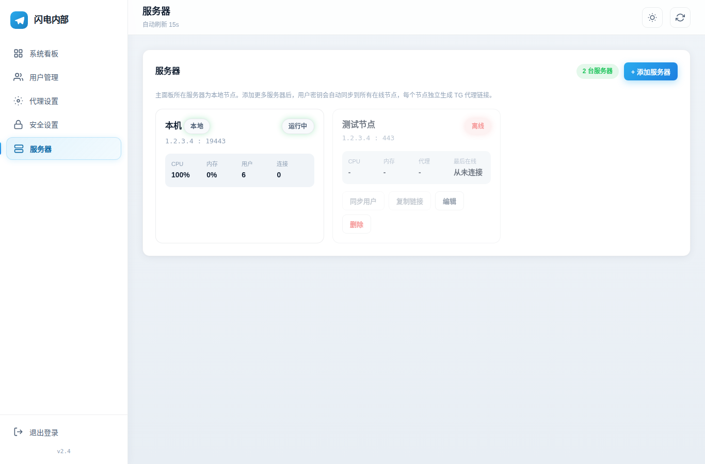
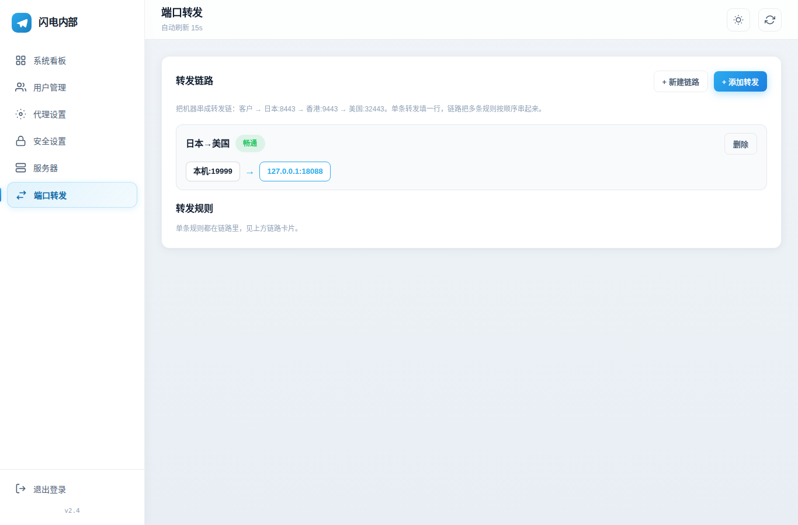

# 闪电内部TG代理管理面板

[](LICENSE)
[](https://www.python.org/)
[](CHANGELOG.md)

> 发布日期：2026-10-08　|　当前版本：v2.5

Telegram MTProto 代理的多用户 Web 管理面板：用户密钥管理、流量配额、到期自动失效、Fake-TLS 混淆、二维码分享、系统监控、多服务器统一管理、SOCKS5 代理，一键脚本完成安装。

## v2.5 更新内容（2026-10-08）

- **端口转发**：转发链路（多机串成一条链）+ 单条转发规则，自助启停，socat 后台转发

## v2.4 更新内容（2026-10-08）

- **白色主题**：默认浅色界面，清爽干净，右上角可切换深色
- **多服务器**：一台面板管理多台服务器，一键安装命令自动注册，用户密钥自动同步，每节点独立生成 TG 链接，节点可改端口/伪装域名
- **SOCKS5**：通用 SOCKS5 代理（默认 1080 端口），每用户独立账号密码，流量计入统计
- **更好用**：用户搜索、最后在线时间、一键导出链接、HTTP 下复制按钮修复

## v2.3 及更早

- **更安全**：全新安装生成 16 位随机管理员密码；登录防暴力破解；JWT 密钥自动生成
- **更快**：添加用户 0.1 秒返回；流量统计、IP 查询加缓存
- **更稳定**：修复无 TAG 启动崩溃、双进程抢端口、并发 500 错误等 5 个 bug
- **纯 IPv4**：IP 获取、链接生成全部只走 IPv4
- **一键安装**：`install.sh` 全自动装完，Debian 11 旧机器也能装

详细清单见 [CHANGELOG.md](CHANGELOG.md)。

## 界面预览

| 登录 | 仪表盘 |
|---|---|
|  |  |

| 用户管理 | 代理设置 |
|---|---|
|  |  |

| 服务器 | 端口转发 |
|---|---|
|  |  |

| 服务器管理 |
|---|
|  |

## 功能特性

| 模块 | 功能 |
|---|---|
| 用户管理 | 添加 / 删除 / 启用 / 禁用用户，每用户独立密钥与备注 |
| 流量配额 | 按用户统计上行 / 下行 / 总量，超额自动禁用 |
| 到期失效 | 按天设置有效期，到期自动禁用并从代理配置剔除 |
| 分享 | `tg://` 一键链接、`https://t.me/proxy` 链接、二维码扫码导入 |
| 代理控制 | 启动 / 停止 / 重启，运行状态与连接数展示 |
| Fake-TLS | `ee` / `dd` / 关闭三档，伪装域名可配置 |
| 系统监控 | CPU / 内存 / 硬盘实时状态 |
| 面板管理 | 端口修改、管理员改密、明暗主题 |
| 多服务器 | 一键添加服务器，用户密钥自动同步，在线状态与资源监控 |
| SOCKS5 | 通用 SOCKS5 代理，每用户独立账号密码，流量计入统计 |

## 多服务器管理

一台面板可管理多台代理服务器：

1. 在面板「服务器」页面点「+ 添加服务器」，复制一键安装命令
2. 在新服务器上以 root 执行该命令，装完自动注册到面板
3. 用户密钥自动同步到所有在线节点，每个节点独立生成 TG 代理链接
4. 面板每 60 秒轮询节点状态（在线/离线、CPU、内存、代理运行状态）

节点需放行 `8899`（agent）与代理端口。用户增删改后自动推送到所有在线节点，也可手动点「同步用户」。

## 一键安装

要求：Debian 10+ / Ubuntu 20.04+，root 权限，约 100MB 内存。

```bash
curl -fsSL https://raw.githubusercontent.com/zxcvdyq888-create/mtproxy-panel/main/install.sh | bash
```

安装完成后脚本会输出面板地址与**随机生成的管理员密码**（仅显示一次）。

```bash
mtproxy-panel status    # 查看状态
mtproxy-panel logs      # 查看日志
mtproxy-panel restart   # 重启面板
mtproxy-panel uninstall # 卸载（数据保留）
```

- 面板地址：`http://服务器IP:8088`
- 代理端口：默认 `443`（可在面板设置中修改）
- 注意：云服务商安全组需放行面板端口与代理端口

## 使用指南

1. 浏览器打开面板地址，用安装时生成的账号密码登录
2. 「用户」页点「添加用户」，填备注、流量配额（GB）、有效天数
3. 点「分享」复制 `tg://` 链接或展示二维码发给朋友，对方点开即导入 Telegram
4. 用户到期或流量用完会自动禁用；也可在列表中手动启用 / 禁用 / 删除

## 安全说明

- **管理员密码**：全新安装时随机生成 16 位密码并仅显示一次；升级安装不覆盖已有密码。请勿长期使用弱密码，可在面板「设置」中修改
- **登录防护**：JWT 密钥首次启动自动生成并持久化；单 IP 60 秒内 5 次登录失败将被临时限制
- **数据存储**：SQLite 本地存储（WAL 模式），用户密钥文件权限 `600`
- **传输加密**：面板默认 HTTP。如需公网长期暴露面板，建议前置 Nginx/Caddy 反向代理并启用 HTTPS
- **网络**：仅 IPv4

## 架构

```
浏览器 ──► 面板 :8088 ──► FastAPI ──► SQLite
                              │
                              ▼
                     生成 config.py ──► 重启 mtprotoproxy
                                              │
Telegram 客户端 ──► 代理 :443 ────────────────┘
```

- **后端**：Python + FastAPI（`panel/app.py` 路由与认证、`panel/database.py` 数据层、`panel/mtproxy_service.py` 代理进程管理、`panel/system_monitor.py` 系统状态）
- **代理核心**：[alexbers/mtprotoproxy](https://github.com/alexbers/mtprotoproxy)，首次启动自动下载
- **前端**：原生 HTML / CSS / JS 单页应用（`panel/static/`），无框架依赖
- **后台任务**：每 15 秒统计流量、清理过期用户；用户变更后代理在后台重启，接口即时返回

共 15 个 REST 接口，均需 `Authorization: Bearer <token>`（登录接口除外）。

## API 接口

| 方法 | 路径 | 说明 |
|---|---|---|
| POST | `/api/auth/login` | 登录，返回 JWT（7 天有效） |
| GET | `/api/dashboard` | 仪表盘：系统状态 + 代理状态 + 用户汇总 |
| GET | `/api/users` | 用户列表（含流量、在线状态） |
| POST | `/api/users` | 添加用户（备注 / 配额 / 有效天数） |
| PUT | `/api/users/{id}` | 编辑用户 |
| DELETE | `/api/users/{id}` | 删除用户 |
| GET | `/api/users/{id}/qrcode` | 用户二维码（PNG） |
| GET | `/api/settings` | 读取配置 |
| PUT | `/api/settings` | 更新配置（端口 / 域名 / TLS / adtag） |
| PUT | `/api/settings/admin` | 修改管理员账号密码 |
| POST | `/api/proxy/start` | 启动代理 |
| POST | `/api/proxy/stop` | 停止代理 |
| POST | `/api/proxy/restart` | 重启代理 |

## 常见问题

**Q: 忘记管理员密码？**
A: 服务器上执行：`python3 -c "import sys; sys.path.insert(0,'/opt/mtproxy-panel/panel'); import database as db; db.update_admin('admin','新密码')"`

**Q: 代理启动失败？**
A: `journalctl -u mtproxy-panel -n 50` 看面板日志；`/opt/mtproxy-panel/logs/proxy.log` 看代理日志。常见原因：端口被占用、adtag 格式错误。

**Q: 用户流量不更新？**
A: 统计线程每 15 秒跑一次，稍等；确认代理正在运行。

**Q: 如何备份？**
A: 备份 `/opt/mtproxy-panel/data/panel.db` 即可（含全部用户与配置）。

## 开源协议

[MIT License](LICENSE)
